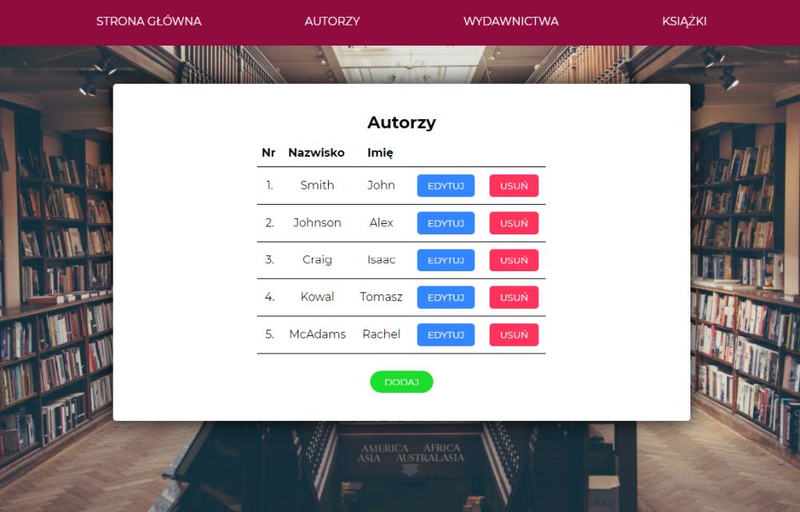
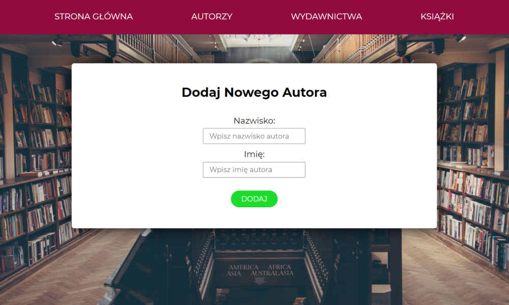

# Books Catalogue App

## Tech Stack:
- ReactJS (Hooks, Context API, React Router)
- JavaScript
- Styled-Components
- Bookstore API: http://139.162.147.107:3493/


Home page view


Authors list with the options to add, remove and edit an item



Form view for adding a new author



## Setup

Clone this repo and run ``` $ npm install ``` to install all dependecies. 

Once the dependencies are installed, you can run ```$ npm start ```  to start the application.

Open [http://localhost:3000](http://localhost:3000) to view it in the browser.

The page will reload if you make edits.\
You will also see any lint errors in the console.
